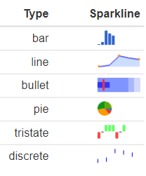

---
output:
  xaringan::moon_reader:
    css: [default, "assets/heidi.css", "assets/heidi-fonts.css"]
    nature:
      highlightStyle: github
      highlightLines: true
      countIncrementalSlides: false
      ratio: 16:9 


---

class: left, top
background-image: url("Images/Metricon 2.jpg")
background-size: cover
opacity: 0.5
## Using R and Power BI in sport
#### Heidi Thornton, PhD | ACU High-Performance Sport Seminar


---

```{r setup, include=FALSE}
library(catapultR)
options(htmltools.dir.version = FALSE, knitr.table.format = "html")
knitr::opts_chunk$set(fig.retina = 3, warning = FALSE, message = FALSE)
library(tidyverse) 
library(emojifont) 
library(fontawesome)
library(emo)
```


class: left

background-image: url("Images/Home.jpg")
background-position: 100% 50%
background-size: 40% 65%

# About me


`r emo::ji("wave")`I'm an applied sports scientist

--

I currently work with two `r emo::ji("football")`teams

--

- Gold Coast Suns Football Club (AFL)


- Newcastle Knights Rugby League Club (NRL)

--

I use R and Power BI daily

--

Outside of work, I love running and the gym `r emo::ji("gym")`

--

`r emo::ji("location")`I live in an pretty amazing place (Newcastle)

---

class: center, middle


<font size="20"> 'Start with the end in mind' </font>


### Credit to [Dr Jacquie Tran](https://jacquietran.github.io/2019_essa_forum/R/#1)


---
class: left

# Why not just use excel?


Both [Alice Sweeting](http://sportstatisticsrsweet.rbind.io/) and [Jacquie Tran](https://www.jacquietran.com/) have presented on this previously

--

BUT the general story is....

--

```{r image_grobs, echo=FALSE, fig.show = "hold", out.width = "24%", fig.align = "center"}
knitr::include_graphics("https://media.giphy.com/media/Sb9KqeeymLlESGWZyE/giphy.gif")

```

---

class: left

# There are better ways! 

```{r out.width = '17%', echo = FALSE, fig.align='center'}

knitr::include_graphics("https://media.giphy.com/media/Qsln1twXgPZE5eOB5a/giphy.gif")

```
--

Both R and Power BI are terrific tools for sports scientists and S&C coaches

--

 R is free, can clean, analyse and visualise


 Power BI is free, easy to use, clean, analyse and visualise


---

class: left

# Lets get started in R

`r emo::ji("exclamation_mark")` I'm skipping the setup of R and Power BI as there are **tonnes** of resources available (see end of presentation)

--

`r emo::ji("heavy_check_mark")` We will create a GPS match report in R **without** touching Excel
 
--

`r emo::ji("key")` Firstly, we need to install a few R **packages**

```{r Load packages, echo=TRUE, message=FALSE, warning=FALSE, eval = FALSE}
Packages <- c('readxl','tidyverse','dplyr','ggplot2', 'sparkline', 'kableExtra', 'data.table',
              'formattable', 'DT')

# Install listed packages
install.packages(Packages)

```


```{r, out.width='10%', echo=FALSE}
knitr::include_graphics('Images/readxl.png')

knitr::include_graphics('Images/dplyr.png')

knitr::include_graphics('Images/KableExtra.jpg')
knitr::include_graphics('Images/ggplot2.jpg')
knitr::include_graphics('Images/datatable.png')
```

---

# CatapultR package

`r emo::ji("heavy_check_mark")` **`catapultR`** is a new R package developed by Catapult 

--

.pull-left[It allows users to pull data directly from their cloud account, speed up reporting processes] 


```{r out.width = '23%', echo = FALSE, fig.align='center'}
knitr::include_graphics("https://media.giphy.com/media/l4HodBpDmoMA5p9bG/giphy.gif")

```

--

```{r catapultR, eval=FALSE, message=FALSE, warning=FALSE}
# Install catapultR
devtools::install_bitbucket("catapultsports/catapultr")
```
--

`r emo::ji("hammer")` **`catapultR`** is still a demo version

You can download it, but Catapult aren't accepting new users just yet

---

# Pull sessions from the cloud

`r fa("allergies", fill = "black")` These credentials are for presentation purposes only 

```{r pull sessions, message=FALSE, warning=FALSE}
# token <- ofCloudGetToken(sRegion = "APAC, sName = " Acc name", sPwd = "acc password",
                        # sClientID = "ID", ClientSecret = "secret")
# activities <- ofCloudGetActivities(token)

# target <- c("Name of game to include")
# activities <- filter(activities, name %in% target)
```


```{r pull sessions working code, message=FALSE, warning=FALSE, include=FALSE}
# Login
token <- ofCloudGetToken(sRegion = "APAC", sName = "GoldCoastFC", sPwd = "SunsAFL2021",
                         sClientID = "TLsJkjQ4Vh3GCNnpKBqzd97A58S2HaebEPrtMUXW", 
                         sClientSecret = "EYv6CqdzkwGgeWpTK7M2bZytF5JQaBxHPsjmf8AX")

# Full list of activities
activities <- ofCloudGetActivities(token)

# Full list of activities
target <- c("210529SatAFLRd11vsHawthorn","210522SatAFLRd10vsGeelong","210515SatAFLRd9vsBrisbane",
            "210508Rd8vsStKilda","210501SatAFLRd7vsCollingwood","210424SatAFLRd6vsSydney",
            "210417SatAFLRd5vsWesternBulldogs","210410SatAFLRd4vsCarlton",
            "210402FriAFLRd3vsAdelaide","210327Rd2vsNorthMelbourne","210321SunAFLRd1vsWestCoast")

activities <- filter(activities, name %in% target)
```

--
`r fa("align-center", fill = "black")` Now lets see what parameters are available to view

```{r view parameters, message=FALSE, warning=FALSE, include=TRUE}
parameters <- ofCloudGetParameters(token)
glimpse(parameters)

```

---

# Create dataset

Using our credentials, we can now select what metrics we want


```{r select parameters, message=FALSE, warning=FALSE, include=TRUE}
data <- ofCloudGetStatistics(
  token, params = c("date", 
        "athlete_name","total_duration","total_distance",
        "meterage_per_minute","velocity_band6_total_distance","max_vel"), 
  
  groupby = c("athlete", "activity"), 
  filters = list(name = "activity_id",
                 comparison = "=",
                 values = activities$id))
```

```{r de-identified names, message=FALSE, warning=FALSE, include=FALSE}
library(readxl)
library(sparkline)
library(dplyr)
names <- read_excel("assets/Athlete Names.xlsx")
data <- merge(data, names, by=c("athlete_name"))
data <- data[c(7,8,2:6)]

```
--
```{r table, message=FALSE, warning=FALSE, include=TRUE, size="tiny"}
head(data, n=3)
```

---

# Summarise data 

 `r fa("chart-bar", fill = "black")`Using a package called **dplyr** we will copy what we might normally do with a pivot table to summarise our data

--

.pull-left[
```{r Summarised table, message=FALSE, warning=FALSE, include=TRUE}
data <- data %>%
    mutate(date=as.Date(as.character(date), 
                  format = "%d/%m/%Y")) %>%
    group_by(date, Name) %>%
        summarize(
          Duration=sum(total_duration)/60,
          Speed_mmin=mean(meterage_per_minute),
          Distance=sum(total_distance),
          HSR=sum(velocity_band6_total_distance),
          Max_velocity=max(max_vel)) %>%
           
      mutate(Duration=round(Duration,0),
          Speed_mmin=round(Speed_mmin,0),
          Distance=round(Distance,0),
          HSR=round(HSR,0), 
          Max_velocity=round(Max_velocity,1))

```
]

--

.pull-right[
```{r Summarised table data, echo=FALSE, message=FALSE, warning=FALSE}
head(data, n=5)
```
]

---
# Sparklines

.pull-left[
`r fa("chart-line", fill = "black")` Sparklines are HTML widgets that can summarise data nicely in reports
<br><br>
I think of them as 'mini graphs' `r emo::ji("doubt")`

```{r sparklines figure, out.width='30%', echo=FALSE}


```
]

--
.pull-right[

```{r sparklines, message=FALSE, warning=FALSE, include=TRUE}    
sparklines <- data %>%
      group_by(Name) %>% 
      arrange(date) %>%
  summarize(
    Distance_SPK = spk_chr(
      round(Distance, 0),
        type='line',
        fillColor = "transparent",
        RangeMin = mean(Distance)-(sd(Distance)*0.5),
        RangeMax = mean(Distance)+(sd(Distance)*0.5),
        chartRangeClip = T,
        chartRangeMinX = 1,
        chartRangeMinX = 60,
        width = 100, height = 15),
    Duration_SPK = spk_chr(
        round(Duration, 0),
        type='line',
        fillColor = "transparent",
        RangeMin = mean(Duration)-(sd(Duration)*0.5),
        RangeMax = mean(Duration)+(sd(Duration)*0.5),
        chartRangeClip = T,
        width = 100,height = 15))
     
```


```{r sparklines shortened, message=FALSE, warning=FALSE, include=FALSE}    
sparklines <- data %>%
        group_by(Name) %>% 
        arrange(date) %>%
    summarize(
      Distance_SPK = spk_chr(
        round(Distance, 0),
          type='line',
          fillColor = "transparent",
          spotColor = F,
          normalRangeMin = mean(Distance)-(sd(Distance) * 0.5),
          normalRangeMax = mean(Distance)+(sd(Distance) * 0.5),
          chartRangeClip = T,
          chartRangeMinX = 1,
          chartRangeMinX = 60,
          width = 100, height = 15),
        Duration_SPK = spk_chr(
            round(Duration, 0),
            type='line',
            fillColor = "transparent",
            spotColor = F,
            normalRangeMin = mean(Duration)-(sd(Duration) * 0.5),
            normalRangeMax = mean(Duration)+(sd(Duration) * 0.5),
            chartRangeClip = T,
            width = 100,height = 15), 
      Speed_mmin_SPK = spk_chr(
            round(Speed_mmin, 0),
            type='line',
            fillColor = "transparent",
            spotColor = F,
            normalRangeMin = mean(Speed_mmin)-(sd(Speed_mmin) * 0.5),
            normalRangeMax = mean(Speed_mmin)+(sd(Speed_mmin) * 0.5),
            chartRangeClip = T,
            width = 100, height = 15))
```
]


---

# Merge dataframes

`r fa("arrow-right", fill = "black")` First we need to merge the summary data and sparklines together using the **dplyr** package

`r fa("filter", fill = "black")` Then filter by the date we want to report on
--

```{r join data and sparklines, message=FALSE, warning=FALSE, include=TRUE} 

combined <- full_join(data, sparklines, by = c("Name")) %>%
                      filter(date == "2021-05-29")

head(combined, n=5)
```

---

# GPS report - Version 1

First we will create a basic table with limited formatting using the **formattable** package

--


```{r table part 1, message=FALSE, warning=FALSE, results='asis'}
library(formattable)
combined <- combined[c(2:10)]
formattable(combined, align = c('c'),
            list(Name = formatter("span", style = ~style(color ="black"), 
                                  options =list(dom ='tp', pageLength = 10, bPaginate=FALSE))))
```


---
# GPS Report 2


```{r GPS Report 2 code, eval=FALSE, message=FALSE, warning=FALSE, include=TRUE}

combined <- combined[c(1,3,10,4,11,5,9,7)] %>%
    filter(Duration > 98) %>%
        ungroup() %>%
        arrange(desc(Duration)) %>%  
       
formattable::formattable(
        list(
            Duration = color_tile("white", "indianred"),
            Speed_mmin = color_tile("white", "indianred"),
            Distance = color_tile("white", "indianred"),
            Max_velocity = color_tile("white", "lightgreen"))) %>%
  
formattable::as.datatable(rownames = FALSE, 
              class = 'white-space: nowrap',
              colnames = c("Name","Duration (mins)","Duration trend","Speed (m.min) ","Speed trend",
                           " Distance (m)","Distance trend","Max speed (m.s)"), 
              options = list(dom = 'tp', 
                        list(pageLength = 20, bPaginate=FALSE,      
                            columnDefs = list(className = 'dt-center', targets = "_all")),
                    fnDrawCallback = 
                    htmlwidgets::
                    JS('function(){HTMLWidgets.staticRender();}')) %>% 
      spk_add_deps() %>%
      formatStyle(c(1,3,5,7), `border-right` = "solid 1px", `border-color` = "darkgrey")

```

---

# GPS Report 2 Output

```{r GPS Report2, echo=FALSE, fig.align='center'}

# Login
token <- ofCloudGetToken(sRegion = "APAC", sName = "GoldCoastFC", sPwd = "SunsAFL2021",
                         sClientID = "TLsJkjQ4Vh3GCNnpKBqzd97A58S2HaebEPrtMUXW", 
                         sClientSecret = "EYv6CqdzkwGgeWpTK7M2bZytF5JQaBxHPsjmf8AX")

# Full list of activities
activities <- ofCloudGetActivities(token)

# Full list of activities
target <- c("210529SatAFLRd11vsHawthorn","210522SatAFLRd10vsGeelong","210515SatAFLRd9vsBrisbane","210508Rd8vsStKilda",
            "210501SatAFLRd7vsCollingwood",
            "210424SatAFLRd6vsSydney","210417SatAFLRd5vsWesternBulldogs","210410SatAFLRd4vsCarlton",
            "210402FriAFLRd3vsAdelaide","210327Rd2vsNorthMelbourne","210321SunAFLRd1vsWestCoast")


activities <- filter(activities, name %in% target)


data <- ofCloudGetStatistics(
      token, params = c("date", 
            "athlete_name","total_duration","total_distance",
            "meterage_per_minute","velocity_band6_total_distance","max_vel"), 
      
      groupby = c("athlete", "activity"), 
      filters = list(name = "activity_id",
                     comparison = "=",
                     values = activities$id))


names <- read_excel("assets/Athlete Names.xlsx")
data <- merge(data, names, by=c("athlete_name"))
data <- data[c(7,8,2:6)]


data <- data %>%
    mutate(date=as.Date(as.character(date), 
                  format = "%d/%m/%Y")) %>%
    group_by(date, Name) %>%
        summarize(
          Duration=sum(total_duration)/60,
          Speed_mmin=mean(meterage_per_minute),
          Distance=sum(total_distance),
          HSR=sum(velocity_band6_total_distance),
          Max_velocity=max(max_vel),
          Max_speed = Max_velocity/3.6) %>%
           
      mutate(Duration=round(Duration,0),
          Speed_mmin=round(Speed_mmin,0),
          Distance=round(Distance,0),
          HSR=round(HSR,0), 
          Max_velocity=round(Max_speed,1))


  sparklines <- data %>%
        group_by(Name) %>% 
        arrange(date) %>%
    summarize(
        Distance_SPK = spk_chr(
          round(Distance, 0),
            type='line',
            fillColor = "transparent",
            spotColor = F,
            normalRangeMin = mean(Distance)-(sd(Distance) * 0.5),
            normalRangeMax = mean(Distance)+(sd(Distance) * 0.5),
            chartRangeClip = T,
           chartRangeMinX = 1,
           chartRangeMinX = 60,
            width = 100, height = 15),
        Duration_SPK = spk_chr(
            round(Duration, 0),
            type='line',
            fillColor = "transparent",
            spotColor = F,
            normalRangeMin = mean(Duration)-(sd(Duration) * 0.5),
            normalRangeMax = mean(Duration)+(sd(Duration) * 0.5),
            chartRangeClip = T,
            width = 100,height = 15), 
      Speed_mmin_SPK = spk_chr(
            round(Speed_mmin, 0),
            type='line',
            fillColor = "transparent",
            spotColor = F,
            normalRangeMin = mean(Speed_mmin)-(sd(Speed_mmin) * 0.5),
            normalRangeMax = mean(Speed_mmin)+(sd(Speed_mmin) * 0.5),
            chartRangeClip = T,
            width = 100, height = 15))

  
 
library(formattable)
library(DT)
library(sparkline)


combined <- merge(data, sparklines, by=c("Name")) %>%
                        filter(date == "2021-05-29")

combined <- combined[c(1,3,10,4,11,5,9,7)] %>%
    filter(Duration > 98) %>%
    filter(Max_velocity > 4) %>%
        ungroup()

combined %>% arrange(desc(Duration)) %>%  
       
  
formattable::formattable(
        list(
            Duration = color_tile("white", "indianred"),
            Speed_mmin = color_tile("white", "indianred"),
            Distance = color_tile("white", "indianred"),
            Max_velocity = color_tile("white", "lightgreen"))) %>%
  
formattable::as.datatable(rownames = FALSE, 
              class = 'white-space: nowrap',
              colnames = c("Name","Duration (mins)","Duration trend","Speed (m.min) ","Speed trend",
                           " Distance (m)","Distance trend","Max speed (m.s)"), 
              options = list(dom = 'tp',
                              bPaginate=FALSE,      
                              columnDefs = list(
                                           list(className = 'dt-center', targets = "_all")),

                    fnDrawCallback = 
                    htmlwidgets::
                    JS('function(){HTMLWidgets.staticRender();}'))) %>% 
      spk_add_deps() %>%
  
     formatStyle(c(1,3,5,7), `border-right` = "solid 1px", `border-color` = "darkgrey")


```


---

# Useful Resources

catapultR - http://catapultr.catapultsports.com/download_catapultR.html

Mitch Henderson - https://www.mitchhenderson.org/

Alice Sweeting - http://sportstatisticsrsweet.rbind.io/


---

class: center, middle

# Good luck!

### `r fa("envelope", fill = "black")` [heidi.thornton@goldcoastfc.com.au](mailto:heidi.thornton@goldcoastfc.com.au)<br>
### `r fa("twitter", fill = "black")` [heidithornton09](https://twitter.com/heidithornton09)<br>


