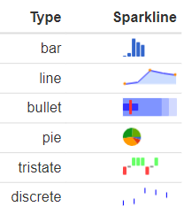

---
output:
  xaringan::moon_reader:
    css: [default, "heidi.css", "assets/heidi-fonts.css"]
    nature:
      highlightStyle: github
      highlightLines: true
      countIncrementalSlides: true
      ratio: 16:9 


---

class: left, top
background-image: url("ACU MHPS 2021/Images/Metricon 2.jpg")
background-size: cover
opacity: 0.5
# Using R and Power BI in Sport
#### Heidi Thornton, PhD | ACU High-Performance Sport Seminar


---

```{r setup, include=FALSE}
library(catapultR)
options(htmltools.dir.version = FALSE, knitr.table.format = "html")
knitr::opts_chunk$set(fig.retina = 3, warning = FALSE, message = FALSE)
library(tidyverse) 
library(emojifont) 
library(fontawesome)
library(emo)
```


class: left

background-image: url("ACU MHPS 2021/Images/Home.jpg")
background-position: 100% 50%
background-size: 40% 65%

# About me


`r emo::ji("wave")`I'm an applied sports scientist

--

I currently work with two `r emo::ji("football")`teams

--

- Gold Coast Suns Football Club (AFL)


- Newcastle Knights Rugby League Club (NRL)

--

I use R and Power BI daily

--

Outside of work, I love running and the gym `r emo::ji("gym")`

--

`r emo::ji("location")`I live in an pretty amazing place (Newcastle)

---

class: center, middle


<font size="20"> 'Start with the end in mind' </font>


### Credit to [Dr Jacquie Tran](https://jacquietran.github.io/2019_essa_forum/R/#1)


---
class: left

# Why not just use excel?


Both [Alice Sweeting](http://sportstatisticsrsweet.rbind.io/) and [Jacquie Tran](https://www.jacquietran.com/) have presented on this previously

--

BUT the general story is....


.pull-left[
```{r image_grobs, echo=FALSE, fig.show = "hold", out.width = "45%"}
knitr::include_graphics("https://media.giphy.com/media/Sb9KqeeymLlESGWZyE/giphy.gif")
```

]
--

.pull-right[
```{r eye roll, echo=FALSE, out.width = "65%"}
knitr::include_graphics("https://media.giphy.com/media/Rhhr8D5mKSX7O/giphy.gif")
```
]


---

class: left

# Lets get started

`r emo::ji("exclamation_mark")` I'm skipping the setup of R and Power BI as there are **tonnes** of resources available (see end of presentation)

--

`r emo::ji("heavy_check_mark")` We will create a GPS match report in R **without** touching Excel
 
--

`r emo::ji("key")` Firstly, we need to install a few R **packages**

```{r Load packages, echo=TRUE, message=FALSE, warning=FALSE, eval = FALSE, fig.align='center'}
Packages <- c('readxl','tidyverse','dplyr','ggplot2', 'sparkline', 'kableExtra', 'data.table',
              'formattable', 'DT')

# Install listed packages
install.packages(Packages)

```
<br>

```{r, out.width='9%', echo=FALSE}
knitr::include_graphics('ACU MHPS 2021/Images/readxl.png')

knitr::include_graphics('ACU MHPS 2021/Images/dplyr.png')


knitr::include_graphics('ACU MHPS 2021/Images/ggplot2.jpg')
knitr::include_graphics('ACU MHPS 2021/Images/datatable.png')
knitr::include_graphics('ACU MHPS 2021/Images/R.jpg')

```

---

# CatapultR package

`r emo::ji("heavy_check_mark")` **`catapultR`** is a new R package developed by Catapult 

--

.pull-left[It allows users to pull data directly from their cloud] 


```{r out.width = '23%', echo = FALSE, fig.align='center'}
knitr::include_graphics("https://media.giphy.com/media/l4HodBpDmoMA5p9bG/giphy.gif")

```

--

`r emo::ji("hammer")` **`catapultR`** is still a demo version


`r emo::ji("SOON arrow")` You can download it, but Catapult aren't accepting new users just yet


```{r catapultR, eval=FALSE, message=FALSE, warning=FALSE}
# Install catapultR
devtools::install_bitbucket("catapultsports/catapultr")
library(catapultR)
```


---

# Pull sessions from the cloud

`r fa("allergies", fill = "black")` These credentials are for presentation purposes only (need your own)

`r emo::ji("key")` This token allows us to query your cloud and access data using the catapult API


```{r pull sessions, message=FALSE, warning=FALSE}
# token <- ofCloudGetToken(sRegion = "America", sName = "brian_wsoccer_demo", sPwd = "d3cCM4yvh6",
                         # sClientID = "h9vrcJ3FXxY71HDzdU0a6C4QLt5VjoOunABsRlK8", 
                         # sClientSecret = "STe67MbNGfkO5XH8jaZDyoQvnz4VBYiL0Clg2RcW")
```


There is a link to request access to catapultR - https://docs.google.com/forms/d/e/1FAIpQLScv8w7OHvzdR05_M-Piu1rNJU9OPzIwsBfLNvY56RZx_nnU_g/viewform


---

# View activities

`r emo::ji("heavy_check_mark")` Now we have saved our account token details, we can select what session/game we want to select


```{r activities list, message=FALSE, warning=FALSE, include=FALSE}
# Login
token <- ofCloudGetToken(sRegion = "APAC", sName = "GoldCoastFC", sPwd = "SunsAFL2021",
                         sClientID = "TLsJkjQ4Vh3GCNnpKBqzd97A58S2HaebEPrtMUXW", 
                         sClientSecret = "EYv6CqdzkwGgeWpTK7M2bZytF5JQaBxHPsjmf8AX")

```

```{r view activities, message=FALSE, warning=FALSE, include=TRUE}
# View activities
activities <- ofCloudGetActivities(token)
glimpse(activities)

```


```{r activivity filter, message=FALSE, warning=FALSE, include=TRUE}

# Select what activities we want to report on
target <- c("210529SatAFLRd11vsHawthorn","210522SatAFLRd10vsGeelong","210515SatAFLRd9vsBrisbane",
            "210508Rd8vsStKilda","210501SatAFLRd7vsCollingwood","210424SatAFLRd6vsSydney",
            "210417SatAFLRd5vsWesternBulldogs","210410SatAFLRd4vsCarlton",
            "210402FriAFLRd3vsAdelaide","210327Rd2vsNorthMelbourne","210321SunAFLRd1vsWestCoast")

activities <- filter(activities, name %in% target)

```


---

# View parameters

`r fa("align-center", fill = "black")` Now lets see what parameters are available to view

Currently, there are **1046** metrics available 

```{r select game and session, message=FALSE, warning=FALSE, include=TRUE}
# view parameters
parameters <- ofCloudGetParameters(token)
glimpse(parameters)

```


---

# Create dataset

`r fa("hand-pointer", fill = "black")` Using our credentials, we can now select what metrics we want

```{r pull sessions working code, message=FALSE, warning=FALSE, include=FALSE}
# Login
token <- ofCloudGetToken(sRegion = "APAC", sName = "GoldCoastFC", sPwd = "SunsAFL2021",
                         sClientID = "TLsJkjQ4Vh3GCNnpKBqzd97A58S2HaebEPrtMUXW", 
                         sClientSecret = "EYv6CqdzkwGgeWpTK7M2bZytF5JQaBxHPsjmf8AX")

# Full list of activities
activities <- ofCloudGetActivities(token)

# Full list of activities
target <- c("210529SatAFLRd11vsHawthorn","210522SatAFLRd10vsGeelong","210515SatAFLRd9vsBrisbane",
            "210508Rd8vsStKilda","210501SatAFLRd7vsCollingwood","210424SatAFLRd6vsSydney",
            "210417SatAFLRd5vsWesternBulldogs","210410SatAFLRd4vsCarlton",
            "210402FriAFLRd3vsAdelaide","210327Rd2vsNorthMelbourne","210321SunAFLRd1vsWestCoast")

activities <- filter(activities, name %in% target)
```


```{r select parameters, message=FALSE, warning=FALSE, include=TRUE}
data <- ofCloudGetStatistics(
        token, params = c("date","athlete_name","total_duration","total_distance",
              "meterage_per_minute","velocity_band6_total_distance","max_vel"), 
  
  groupby = c("athlete", "activity"), 
            filters = list(name = "activity_id",
                           comparison = "=",
                           values = activities$id))
```

```{r de-identified names, message=FALSE, warning=FALSE, include=FALSE}
library(readxl)
library(sparkline)
library(dplyr)
names <- read_excel("ACU MHPS 2021/assets/Athlete Names.xlsx")
data <- merge(data, names, by=c("athlete_name"))
data <- data[c(7,8,2:6)]

```
--
```{r table, message=FALSE, warning=FALSE, include=TRUE, size="tiny"}
head(data, n=3)
```

---

# Summarise data 

 `r fa("chart-bar", fill = "black")` Using the **`dplyr`** package, we will replicate what we might normally do with a **pivot table** to summarise our data

--

```{r Summarised table, message=FALSE, warning=FALSE, include=TRUE}
data <- data %>%
    mutate(date=as.Date(as.character(date), format = "%d/%m/%Y")) %>%
  
    group_by(date, Name) %>%
              summarize(
                  Duration=sum(total_duration)/60,
                  Speed_mmin=mean(meterage_per_minute),
                  Distance=sum(total_distance),
                  HSR=sum(velocity_band6_total_distance),
                  Max_velocity=max(max_vel))

```


--


```{r Summarised table data, echo=FALSE, message=FALSE, warning=FALSE}
head(data, n=5)
```


---
# Sparklines

--
.pull-left[
`r fa("chart-line", fill = "black")` Sparklines are HTML widgets that can summarise data nicely in reports


I think of them as 'mini graphs' `r emo::ji("doubt")`

```{r sparklines figure, out.width='55%', echo=FALSE}


```
]

--
.pull-right[

```{r sparklines, message=FALSE, warning=FALSE, include=TRUE}    
sparklines <- data %>%
      group_by(Name) %>% 
      arrange(date) %>%
  summarize(
    Distance_SPK = spk_chr(
      round(Distance, 0),
        type='line',
        fillColor = "transparent",
        RangeMin = mean(Distance)-(sd(Distance)*0.5),
        RangeMax = mean(Distance)+(sd(Distance)*0.5),
        chartRangeClip = T,
        width = 100, height = 15),
    
    Duration_SPK = spk_chr(
        round(Duration, 0),
        type='line',
        fillColor = "transparent",
        RangeMin = mean(Duration)-(sd(Duration)*0.5),
        RangeMax = mean(Duration)+(sd(Duration)*0.5),
        chartRangeClip = T,
        width = 100,height = 15))
```


```{r sparklines shortened, message=FALSE, warning=FALSE, include=FALSE}    
sparklines <- data %>%
        group_by(Name) %>% 
        arrange(date) %>%
    summarize(
      Distance_SPK = spk_chr(
        round(Distance, 0),
          type='line',
          fillColor = "transparent",
          spotColor = F,
          normalRangeMin = mean(Distance)-(sd(Distance) * 0.5),
          normalRangeMax = mean(Distance)+(sd(Distance) * 0.5),
          chartRangeClip = T,
          chartRangeMinX = 1,
          chartRangeMinX = 60,
          width = 100, height = 15),
        Duration_SPK = spk_chr(
            round(Duration, 0),
            type='line',
            fillColor = "transparent",
            spotColor = F,
            normalRangeMin = mean(Duration)-(sd(Duration) * 0.5),
            normalRangeMax = mean(Duration)+(sd(Duration) * 0.5),
            chartRangeClip = T,
            width = 100,height = 15), 
      Speed_mmin_SPK = spk_chr(
            round(Speed_mmin, 0),
            type='line',
            fillColor = "transparent",
            spotColor = F,
            normalRangeMin = mean(Speed_mmin)-(sd(Speed_mmin) * 0.5),
            normalRangeMax = mean(Speed_mmin)+(sd(Speed_mmin) * 0.5),
            chartRangeClip = T,
            width = 100, height = 15))
```
]

---
# Sparklines dataset


```{r sparklines shortened 2, echo=FALSE, message=FALSE, warning=FALSE}
sparklines <- data %>%
        group_by(Name) %>% 
        arrange(date) %>%
    summarize(
      Distance_SPK = spk_chr(
        round(Distance, 0),
          type='line',
          fillColor = "transparent",
          spotColor = F,
          normalRangeMin = mean(Distance)-(sd(Distance) * 0.5),
          normalRangeMax = mean(Distance)+(sd(Distance) * 0.5),
          chartRangeClip = T,
          chartRangeMinX = 1,
          chartRangeMinX = 60,
          width = 100, height = 15),
        Duration_SPK = spk_chr(
            round(Duration, 0),
            type='line',
            fillColor = "transparent",
            spotColor = F,
            normalRangeMin = mean(Duration)-(sd(Duration) * 0.5),
            normalRangeMax = mean(Duration)+(sd(Duration) * 0.5),
            chartRangeClip = T,
            width = 100,height = 15), 
      Speed_mmin_SPK = spk_chr(
            round(Speed_mmin, 0),
            type='line',
            fillColor = "transparent",
            spotColor = F,
            normalRangeMin = mean(Speed_mmin)-(sd(Speed_mmin) * 0.5),
            normalRangeMax = mean(Speed_mmin)+(sd(Speed_mmin) * 0.5),
            chartRangeClip = T,
            width = 100, height = 15))
```


---

# Merge data frames

`r fa("arrow-right", fill = "black")` First we need to merge the summary data and sparklines together using the **`dplyr`** package

`r fa("filter", fill = "black")` Then filter by the date we want to report on
--

```{r join data and sparklines, message=FALSE, warning=FALSE, include=TRUE} 

combined <- full_join(data, sparklines, by = c("Name")) %>%
                      filter(date == "2021-05-29")

head(combined, n=5)
```

---

# GPS report - Version 1

First we will create a basic table with limited formatting using the **`formattable`** package

--

```{r table part 1, eval=FALSE, message=FALSE, warning=FALSE, include=TRUE}
library(formattable)

formattable(combined, align = c('c'), list(options =list(dom ='tp')))
```

--

```{r table part 1 actual table, echo=FALSE, message=FALSE, warning=FALSE}
library(formattable)
combined <- combined %>% slice_max(combined$Duration, n = 8)

formattable(combined, align = c('c'), list(options =list(dom ='tp')))
```

---

# GPS report - Version 2

`r emo::ji("heavy_check_mark")` A few more steps with this one, but worth it for the final product

```{r GPS Report 2 code, eval=FALSE, message=FALSE, warning=FALSE, include=TRUE}

combined <- combined[c(1,3,10,4,11,5,9,7)] %>%
    filter(Duration > 98) %>%
        ungroup() %>%

formattable::formattable
        list(Duration = color_tile("white","indianred"),
             Speed_mmin = color_tile("white","indianred"),
             Distance = color_tile("white","indianred"),
             Max_velocity = color_tile("white","lightgreen"))) %>%
  
formattable::as.datatable(rownames = FALSE, 
              class = 'white-space: nowrap',
              colnames = c("Name","Duration (mins)","Duration trend","Speed (m.min) ","Speed trend",
                           " Distance (m)","Distance trend","Max speed (m.s)"), 
              options = list(dom = 'tp', bPaginate=FALSE, 
              columnDefs = list(className = 'dt-center', targets = "_all")),
                    fnDrawCallback = htmlwidgets::
                    JS('function(){HTMLWidgets.staticRender();}')) %>% 
      spk_add_deps() %>%
      formatStyle(c(1,3,5,7), `border-right` = "solid 1px", `border-color` = "darkgrey")

```

---

# GPS Report - Version 2 outut

```{r GPS Report2, echo=FALSE, fig.align='center'}

# Login
token <- ofCloudGetToken(sRegion = "APAC", sName = "GoldCoastFC", sPwd = "SunsAFL2021",
                         sClientID = "TLsJkjQ4Vh3GCNnpKBqzd97A58S2HaebEPrtMUXW", 
                         sClientSecret = "EYv6CqdzkwGgeWpTK7M2bZytF5JQaBxHPsjmf8AX")

# Full list of activities
activities <- ofCloudGetActivities(token)

# Full list of activities
target <- c("210529SatAFLRd11vsHawthorn","210522SatAFLRd10vsGeelong","210515SatAFLRd9vsBrisbane","210508Rd8vsStKilda",
            "210501SatAFLRd7vsCollingwood",
            "210424SatAFLRd6vsSydney","210417SatAFLRd5vsWesternBulldogs","210410SatAFLRd4vsCarlton",
            "210402FriAFLRd3vsAdelaide","210327Rd2vsNorthMelbourne","210321SunAFLRd1vsWestCoast")


activities <- filter(activities, name %in% target)


data <- ofCloudGetStatistics(
      token, params = c("date", 
            "athlete_name","total_duration","total_distance",
            "meterage_per_minute","velocity_band6_total_distance","max_vel"), 
      
      groupby = c("athlete", "activity"), 
      filters = list(name = "activity_id",
                     comparison = "=",
                     values = activities$id))


names <- read_excel("assets/Athlete Names.xlsx")
data <- merge(data, names, by=c("athlete_name"))
data <- data[c(7,8,2:6)]


data <- data %>%
    mutate(date=as.Date(as.character(date), 
                  format = "%d/%m/%Y")) %>%
    group_by(date, Name) %>%
        summarize(
          Duration=sum(total_duration)/60,
          Speed_mmin=mean(meterage_per_minute),
          Distance=sum(total_distance),
          HSR=sum(velocity_band6_total_distance),
          Max_velocity=max(max_vel),
          Max_speed = Max_velocity/3.6) %>%
           
      mutate(Duration=round(Duration,0),
          Speed_mmin=round(Speed_mmin,0),
          Distance=round(Distance,0),
          HSR=round(HSR,0), 
          Max_velocity=round(Max_speed,1))


  sparklines <- data %>%
        group_by(Name) %>% 
        arrange(date) %>%
    summarize(
        Distance_SPK = spk_chr(
          round(Distance, 0),
            type='line',
            fillColor = "transparent",
            spotColor = F,
            normalRangeMin = mean(Distance)-(sd(Distance) * 0.5),
            normalRangeMax = mean(Distance)+(sd(Distance) * 0.5),
            chartRangeClip = T,
           chartRangeMinX = 1,
           chartRangeMinX = 60,
            width = 100, height = 15),
        Duration_SPK = spk_chr(
            round(Duration, 0),
            type='line',
            fillColor = "transparent",
            spotColor = F,
            normalRangeMin = mean(Duration)-(sd(Duration) * 0.5),
            normalRangeMax = mean(Duration)+(sd(Duration) * 0.5),
            chartRangeClip = T,
            width = 100,height = 15), 
      Speed_mmin_SPK = spk_chr(
            round(Speed_mmin, 0),
            type='line',
            fillColor = "transparent",
            spotColor = F,
            normalRangeMin = mean(Speed_mmin)-(sd(Speed_mmin) * 0.5),
            normalRangeMax = mean(Speed_mmin)+(sd(Speed_mmin) * 0.5),
            chartRangeClip = T,
            width = 100, height = 15))

  
 
library(formattable)
library(DT)
library(sparkline)


combined <- merge(data, sparklines, by=c("Name")) %>%
                        filter(date == "2021-05-29")

combined <- combined[c(1,3,10,4,11,5,9,7)] %>%
    filter(Duration > 99) %>%
    filter(Max_velocity > 4) %>%
        ungroup()

combined %>% arrange(desc(Duration)) %>%  
       
  
formattable(
        list(
            Duration = color_tile("white", "indianred"),
            Speed_mmin = color_tile("white", "indianred"),
            Distance = color_tile("white", "indianred"),
            Max_velocity = color_tile("white", "lightgreen"))) %>%
  
as.datatable(rownames = FALSE, 
              class = 'white-space: nowrap',
              colnames = c("Name","Duration (mins)","Duration trend","Speed (m.min) ","Speed trend",
                           " Distance (m)","Distance trend","Max speed (m.s)"), 
              options = list(dom = 'tp',
                              bPaginate=FALSE,      
                              columnDefs = list(
                                           list(className = 'dt-center', targets = "_all")),

                    fnDrawCallback = 
                    htmlwidgets::
                    JS('function(){HTMLWidgets.staticRender();}'))) %>% 
      spk_add_deps() %>%
  
     formatStyle(c(1,3,5,7), `border-right` = "solid 1px", `border-color` = "darkgrey")


```

---

# Power BI

`r fa("file-excel")`  If you know how to use **Microsoft Excel**, you'll already know parts of **Microsoft Power BI**

--

`r emo::ji("chart increasing")` Create simple, powerful visualisations, in a time efficient manner

--

 `r fa("dollar-sign")` It's **free** (desktop version)

--

`r emo::ji("backhand index pointing right")` All calculations/formulas can be done directly in **Power BI**

--

`r emo::ji("heavy_check_mark")` Download direct from the internet

<br>

```{r power bi, out.width = '15%', echo = FALSE, fig.align='center'}
knitr::include_graphics("ACU MHPS 2021/Images/pb.png")

```


---

# Power BI report

`r fa("r-project")` Create a drill intensity report also using R showing intensity of drills compared to the peak of a game for 3 metrics 

--
```{r power bi report 2, echo=FALSE, fig.align='center', out.width='55%'}
library(pdftools)
magick::image_read_pdf("ACU MHPS 2021/Images/Drill Intensity Breakdown.pdf", pages = 1)

```


---

# Power BI data

`r emo::ji("backhand index pointing right")` Repeat similiar steps using **`catapultR`** and added in **period name** (drill name)

--

```{r power bi pull sessions hidden, message=FALSE, warning=FALSE, include=FALSE}
token <- ofCloudGetToken(sRegion = "APAC", sName = "GoldCoastFC", sPwd = "SunsAFL2021",
                         sClientID = "TLsJkjQ4Vh3GCNnpKBqzd97A58S2HaebEPrtMUXW", 
                         sClientSecret = "EYv6CqdzkwGgeWpTK7M2bZytF5JQaBxHPsjmf8AX")

activities <- ofCloudGetActivities(token)
activities <-filter(activities, activities$name=="210609Wed")

# Pull through most recent data
data <- ofCloudGetStatistics(token, 
    params = c("date", "activity_name","athlete_name","period_name","start_time_h","end_time_h", 
               "total_duration","meterage_per_minute","hirmin","acceleration_density"), 
    
    groupby = c("athlete", "period", "activity"), 
    filters = list(name = "activity_id",
                   comparison = "=",
                   values = activities$id[1]))

data$total_duration <- as.numeric(data$total_duration)/60
write.csv(data, row.names=FALSE, "assets/data.csv") 

```


```{r power bi pull sessions, message=FALSE, warning=FALSE, include=TRUE}
# token <- ofCloudGetToken(sRegion = "APAC, sName = " Acc name", sPwd = "acc password",
                        # sClientID = "ID", ClientSecret = "secret")

activities <- ofCloudGetActivities(token)
activities <-filter(activities, activities$name=="210609Wed")

# Pull through most recent data
data <- ofCloudGetStatistics(token, 
                             
  params = c("date", "activity_name","athlete_name","period_name","start_time_h","end_time_h", 
             "total_duration","meterage_per_minute","hirmin","acceleration_density"), 
  
  groupby = c("athlete", "period", "activity"), 
  filters = list(name = "activity_id",
                 comparison = "=",
                 values = activities$id[1]))

data$total_duration <- as.numeric(data$total_duration)/60
write.csv(data, row.names=FALSE, "assets/data.csv") # Export data

```

---

# Create Power BI report


- Open power BI and connect data using **Get Data** button

- Calculate **% game intensity** columns using pre-determined **intercept** (peak intensity) and **slope** (decrement) values

- Add a table and select columns you want (averages)
--

<br>

.pull-left[
```{r power bi intercept and slope, echo = FALSE, out.width='95%'}


```

]

.pull-right[
```{r power bi formula, echo = FALSE, out.width='110%'}


```

]


--


.footnote[
**References** <br>
Delaney et al. (2017). Modelling the decrement in running intensity within professional soccer players. Science and Medicine in Football. <br>
Duthie et al. (2018). Running intensities in elite youth soccer by age. Journla of Strength and Conditioning Research. 
]
---

# Formatting


`r emo::ji("vertical traffic light")`	Colour code the table to reflect the intensity of each drill using **conditional formatting** rules 
 
- Below: 0-89%
- At: 90-109%
- Above: 110-129%
- Above: 130%+

<br>
 
```{r power bi rules, echo = FALSE, out.width='50%'}


```


---

# Power BI report version 2


`r emo::ji("chart")` Alternatively, we can select other options such as data bars, icons, font colour etc


```{r power bi ticks, echo = FALSE, out.width='110%'}


```

---

# Useful Resources

catapultR - http://catapultr.catapultsports.com/download_catapultR.html

Mitch Henderson - https://www.mitchhenderson.org/

Alice Sweeting - http://sportstatisticsrsweet.rbind.io/

Josh Trewin - http://futbolanalysr.rbind.io/

Neil Collins - https://www.sportscidata.com/

Jose Fernandez - https://twitter.com/jfernandez__

---

class: center, middle

# Thank you and good luck!

#### `r fa("envelope", fill = "black")` [heidi.thornton@goldcoastfc.com.au](mailto:heidi.thornton@goldcoastfc.com.au)<br>
#### `r fa("twitter", fill = "black")` [heidithornton09](https://twitter.com/heidithornton09)<br>


